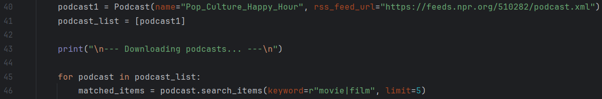

# Auto Podcast Downloader and Transcriber
This project utilizes Beautiful Soup for web scraping to enable the automatic downloading of episodes containing keywords of interest from your specified podcast channels. It further integrates with the AssemblyAI API to transcribe each downloaded episode into accurate textual transcripts, empowering you to easily navigate and find specific information within the episodes.

## Setup

To access all the files, I suggest you start by forking this repository. Once you've forked it, proceed to clone or download the content locally to your computer.

To ensure that your system has all the required Python libraries, follow these steps:

1. Make sure you have Python installed on your system and added to the system's PATH.
2. Open a command prompt or Terminal window.
3. Navigate to the directory containing the `requirements.txt` file using the `cd` command.
4. Run the following command to install the required Python libraries:

   ```bash
   pip install -r path\to\requirements.txt

Now that you have the files & libraries locally, you need to:  

1. Go into the [download_podcasts.py](https://github.com/SylviaLi00/auto-podcast-downloader-and-transcriber/blob/main/download_podcasts.py) & [transcribe_podcast.py](https://github.com/SylviaLi00/auto-podcast-downloader-and-transcriber/blob/main/transcribe_podcast.py) file and modify the ```podcast_list``` as shown in the screenshot below. Modify or add the names and RSS feeds of the podcasts you like to the list. You can add as many podcasts as you want.
  
2. Adjust the keywords for podcasts that interest you. Replace 'keyword' with any terms you find interesting in the ```search_items``` function.

3. Modify the number of podcast episodes you want to download and transcribe. In the ```search_items``` function, replace 'limit' with the desired number of episodes you want to download.



## Run the Scripts

After completing the steps above, you can execute the 'run_scripts.bat' file. This will initiate the automatic download and transcription of the podcast episodes that interest you. A sample of the download and transcription process is shown in the following screenshot.


After the execution is complete, you can find the downloaded episodes in the 'downloads' folder and the transcribed text files in the 'transcripts' folder. Sample files and transcripts are shown in the screenshots below.

*downloads_folder_sample*

 

*transcripts_folder_sample*
  
 

*transcripts_sample*
  
 
